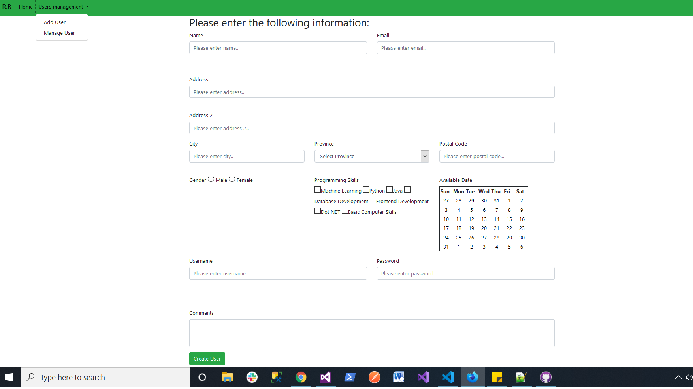
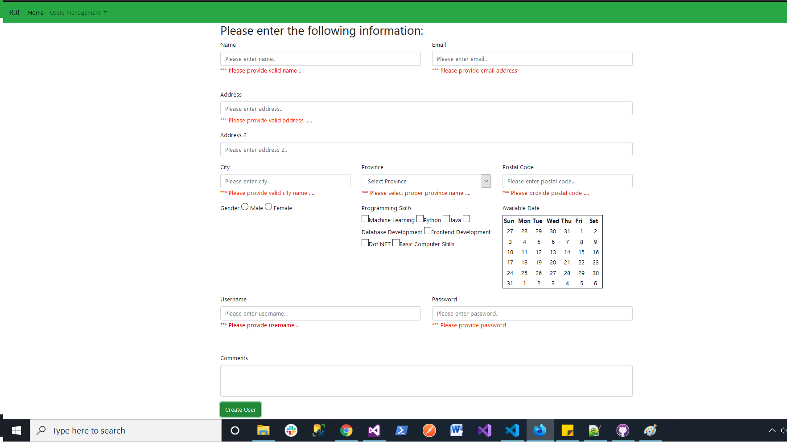
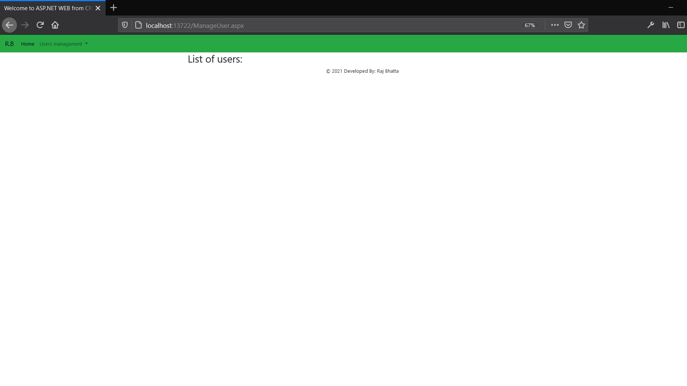
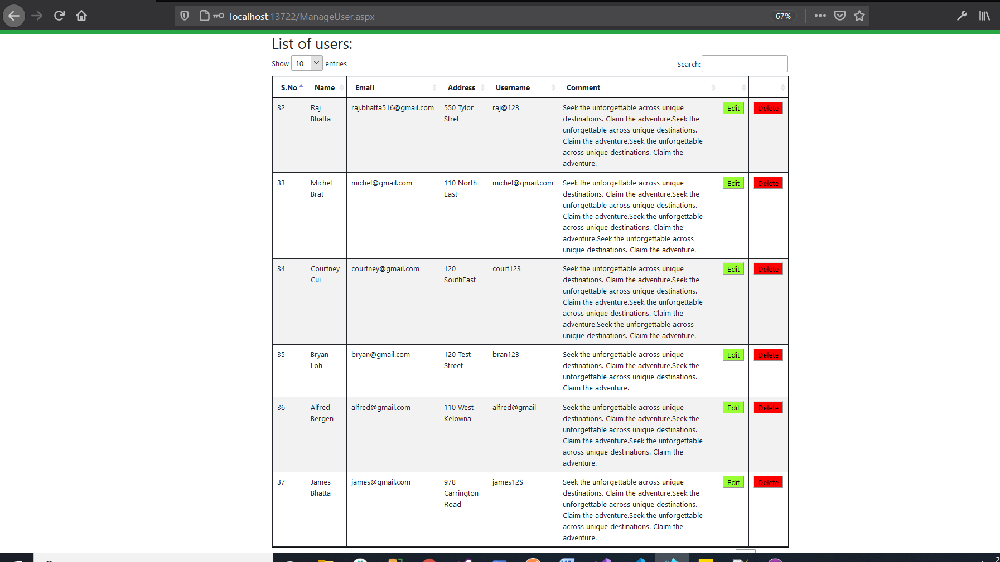
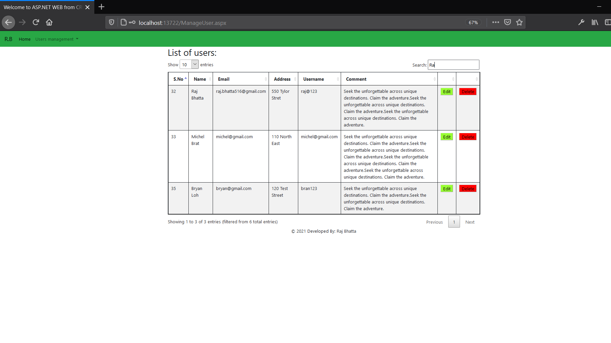
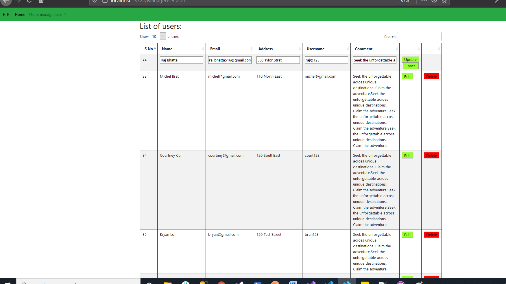
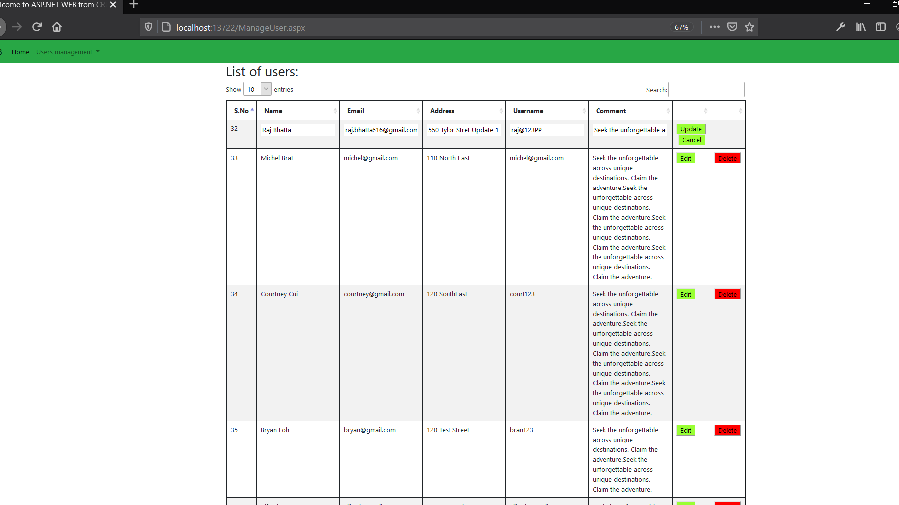
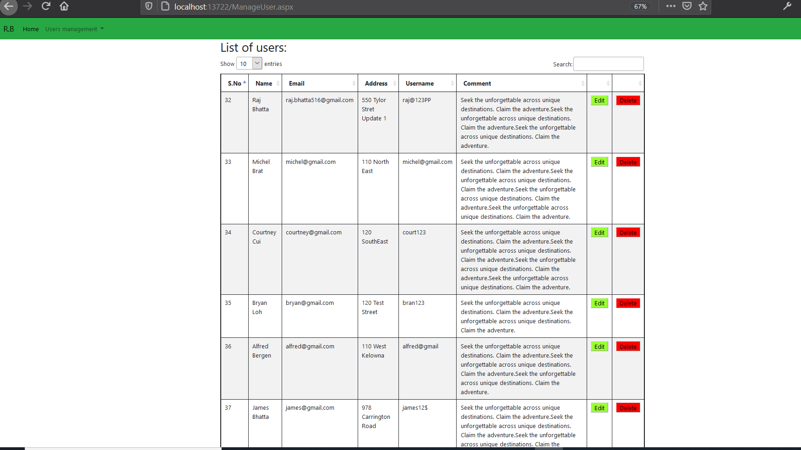
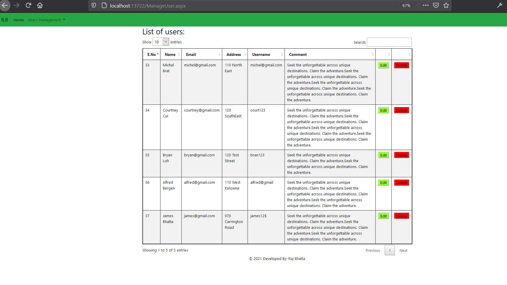

## CRUD operations using Bootstrap, MSQL and ASP.NET form ##
### 1. Create user operation ###

### 2. Create user mandatory field validation ###

### 3. Create user email and password validation ###

### 4. Gridview without data ###

### 5. Gridview with pagination ###

### 6. Gridview with search ###

### 7. Edit operation ###

### 8. Data on GridView with updated value ###

### 9. After performing update ###

### 10. After peforming delete operation ###
